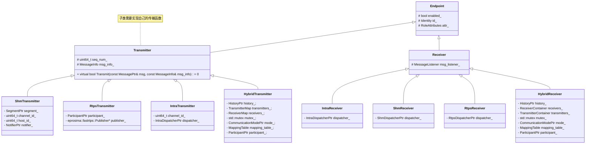
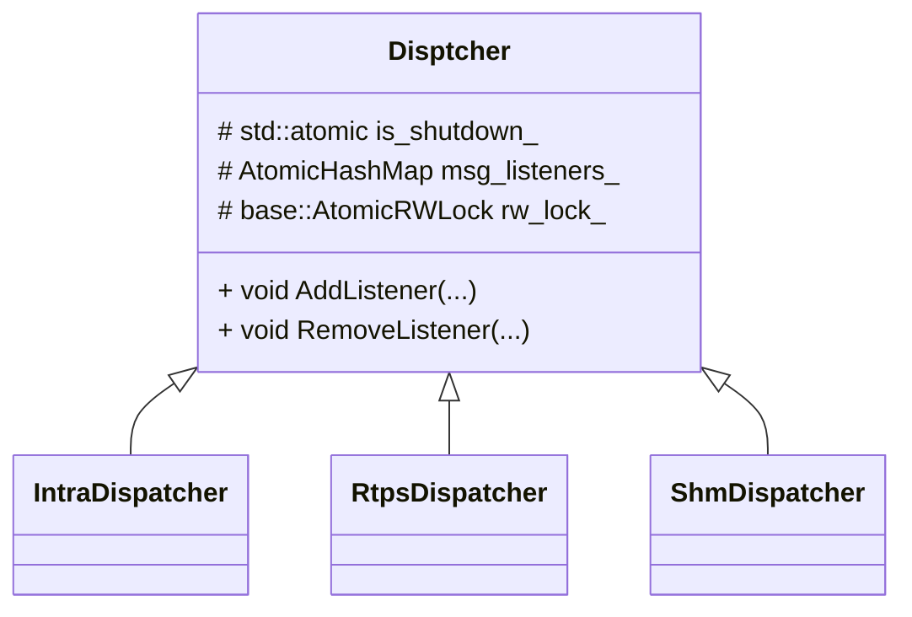
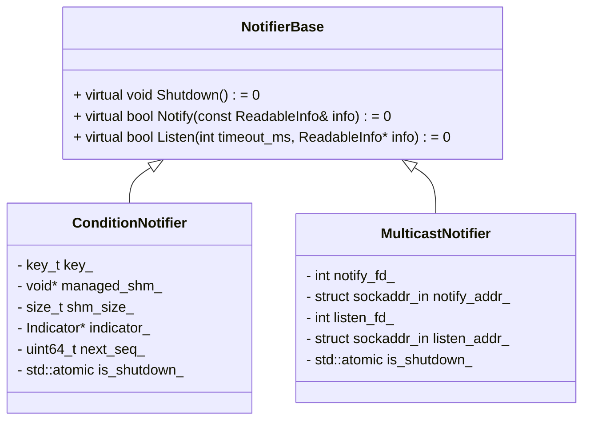
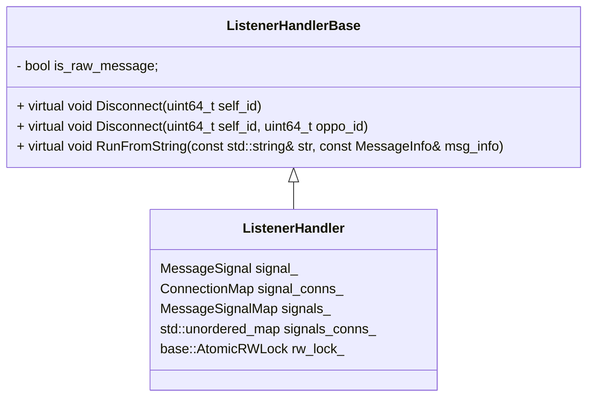

## cyber通信基础

### 1、上层传输

#### Node

```cpp
class Node {
  std::string node_name_;
  std::string name_space_;

  std::mutex readers_mutex_;
  std::map<std::string, std::shared_ptr<ReaderBase>> readers_;

  std::unique_ptr<NodeChannelImpl> node_channel_impl_ = nullptr;
  std::unique_ptr<NodeServiceImpl> node_service_impl_ = nullptr;
};
```


```cpp
class NodeChannelImpl
{

  bool is_reality_mode_;
  std::string node_name_;
  proto::RoleAttributes node_attr_;
  NodeManagerPtr node_manager_ = nullptr;			//用于服务发现!
};
```

```cpp
class NodeServiceImpl
{
  std::vector<std::weak_ptr<ServiceBase>> service_list_;
  std::vector<std::weak_ptr<ClientBase>> client_list_;
  std::string node_name_;
  proto::RoleAttributes attr_;
};
```

一个Reader/Writer与固定的信息类型绑定。

```c++
template <typename MessageT>
class Reader: public ReaderBase
{
public:
      CallbackFunc<MessageT> reader_func_;
      ReceiverPtr receiver_ = nullptr;
      std::string croutine_name_;
      BlockerPtr blocker_ = nullptr;
      ChangeConnection change_conn_;
      service_discovery::ChannelManagerPtr channel_manager_ = nullptr;
};
```

```c++
template<typename MessageT>
class Writer: public WriterBase
{
public:
      using TransmitterPtr = std::shared_ptr<transport::Transmitter<MessageT>>;
    
      //实际传输实现
      TransmitterPtr transmitter_;
      ChangeConnection change_conn_;
      service_discovery::ChannelManagerPtr channel_manager_;
};
//核心函数
template <typename MessageT>
bool Writer<MessageT>::Write(const std::shared_ptr<MessageT>& msg_ptr) {
  RETURN_VAL_IF(!WriterBase::IsInit(), false);
  return transmitter_->Transmit(msg_ptr);
}
```

#### DataVisitor

内部数据访问器。每一个在组件或者readerd在初始化的时候都会创建一个。

```c++
class DataVisitorBase {
   public:
    DataVisitorBase() : notifier_(new Notifier()) {}

    void RegisterNotifyCallback(std::function<void()>&& callback) {
      notifier_->callback = callback;
    }
    uint64_t next_msg_index_ = 0;
    DataNotifier* data_notifier_ = DataNotifier::Instance();		//用于获取全局数据通知器
    std::shared_ptr<Notifier> notifier_;							//通知回调函数
};

class DataVisitor: public DataVisitorBase
{
private:
  fusion::DataFusion<M0, M1, M2, M3>* data_fusion_ = nullptr;
  ChannelBuffer<M0> buffer_m0_;
  ChannelBuffer<M1> buffer_m1_;
  ChannelBuffer<M2> buffer_m2_;
  ChannelBuffer<M3> buffer_m3_;
};
```

在内部数据访问器创建的时候，会将channel_id和通知函数注册到全局的数据通知器上去。

```cpp
  explicit DataVisitor(const std::vector<VisitorConfig>& configs)
      : buffer_m0_(configs[0].channel_id,
                   new BufferType<M0>(configs[0].queue_size)),
        buffer_m1_(configs[1].channel_id,
                   new BufferType<M1>(configs[1].queue_size)),
        buffer_m2_(configs[2].channel_id,
                   new BufferType<M2>(configs[2].queue_size)),
        buffer_m3_(configs[3].channel_id,
                   new BufferType<M3>(configs[3].queue_size)) {
    DataDispatcher<M0>::Instance()->AddBuffer(buffer_m0_);
    DataDispatcher<M1>::Instance()->AddBuffer(buffer_m1_);
    DataDispatcher<M2>::Instance()->AddBuffer(buffer_m2_);
    DataDispatcher<M3>::Instance()->AddBuffer(buffer_m3_);
    data_notifier_->AddNotifier(buffer_m0_.channel_id(), notifier_);		//注册channel_id与回调函数
    data_fusion_ = new fusion::AllLatest<M0, M1, M2, M3>(
        buffer_m0_, buffer_m1_, buffer_m2_, buffer_m3_);
  }
```


#### DataNotifier

数据通知器：它是一个全局的单例。保存了chanel_id与通知函数数组的一个无锁定长哈希表。一个channel也许会有多个通知函数（存在多个订阅者）。

```c++
struct Notifier {
  std::function<void()> callback;
};
class DataNotifier
{
public:
    using NotifyVector = std::vector<std::shared_ptr<Notifier>>;
    
private:
    std::mutex notifies_map_mutex_;
    //channel_id : <func1_, func2_, func3_...>
    AtomicHashMap<uint64_t, NotifyVector> notifies_map_;  ////lock-free的哈希表
};
```

#### DataDispatcher

数据分发器：它是一个全局单例。

```c++
class DataDispatcher
{
public:
    using BufferVector =
    std::vector<std::weak_ptr<CacheBuffer<std::shared_ptr<T>>>>; //这里是弱引用，因为CacheBuffer可能会失效
    DataNotifier* notifier_ = DataNotifier::Instance();
    std::mutex buffers_map_mutex_;
    //channel_id -> 多个缓存数据
    AtomicHashMap<uint64_t, BufferVector> buffers_map_;		//lock-free的哈希表
};
```

主要作用是：向某个channel分发收到的数据，它会先从map中取出所有对应的buffer，然后调用CacheBuffer::Fill函数来给buffer填数据（这里的Fill函数还会去把所有种类的消息整合成一条新的整合数据，后面会介绍），之后再调用DataNotifier::Notify函数来找出所有对应该channel_id的Notifier并调用它们唤醒一开始创建的协程来取数据并运行回调函数。

### 2、底层传输实现

#### Transport

它是一个全局单例，创建实际的接收体和发送体。



#### Dispatcher

消息分发器，每一个实际数据接收体，都包含自己特有的消息接受器。



### 3、消息通知机制

##### 共享内存的消息通知机制



##### ConditionNotifier

ConditionNotifier是默认的通知机制，用于共享内存之间消息传递的通知。

无论是发送端的`ShmTransmitter`还是接收端的`ShmReceiver`内部都有一个`NotifierPtr`，用于获取一个固定区域的共享内存。

```cpp
ConditionNotifier::ConditionNotifier() {
  //system-v的方式，固定了一个key.
  key_ = static_cast<key_t>(Hash("/apollo/cyber/transport/shm/notifier"));
  ADEBUG << "condition notifier key: " << key_;
  shm_size_ = sizeof(Indicator);

  if (!Init()) {
    AERROR << "fail to init condition notifier.";
    is_shutdown_.store(true);
    return;
  }
  next_seq_ = indicator_->next_seq.load();
  ADEBUG << "next_seq: " << next_seq_;
}
```

对于共享内存通信方而言，写端最终调用：`bool ShmTransmitter<M>::Transmit`，向共享内存中写入数据，然后调用通知读端可以读取数据了。

```cpp
template <typename M>
bool ShmTransmitter<M>::Transmit(const M& msg, const MessageInfo& msg_info) {
  if (!this->enabled_) {
    ADEBUG << "not enable.";
    return false;
  }

  WritableBlock wb;
  std::size_t msg_size = message::ByteSize(msg);
  if (!segment_->AcquireBlockToWrite(msg_size, &wb)) {
    AERROR << "acquire block failed.";
    return false;
  }

  ADEBUG << "block index: " << wb.index;
  if (!message::SerializeToArray(msg, wb.buf, static_cast<int>(msg_size))) {
    AERROR << "serialize to array failed.";
    segment_->ReleaseWrittenBlock(wb);
    return false;
  }
  wb.block->set_msg_size(msg_size);

  char* msg_info_addr = reinterpret_cast<char*>(wb.buf) + msg_size;
  if (!msg_info.SerializeTo(msg_info_addr, MessageInfo::kSize)) {
    AERROR << "serialize message info failed.";
    segment_->ReleaseWrittenBlock(wb);
    return false;
  }
  wb.block->set_msg_info_size(MessageInfo::kSize);
  segment_->ReleaseWrittenBlock(wb);

  ReadableInfo readable_info(host_id_, wb.index, channel_id_);

  ADEBUG << "Writing sharedmem message: "
         << common::GlobalData::GetChannelById(channel_id_)
         << " to block: " << wb.index;
  return notifier_->Notify(readable_info);		//修改共享内存中信息，以便loop的读取线程可以读取到数据。
}
```

和ecal类似，共享内存段是由发送端维护的，接收端仅仅负责读取。

共享内存数据分发器的工作线程持续监听共享内存`/apollo/cyber/transport/shm/notifier`的指示器的下一个seq，如果下一个seq。


#### 回调与槽

一个信号可以与多个槽关联。



